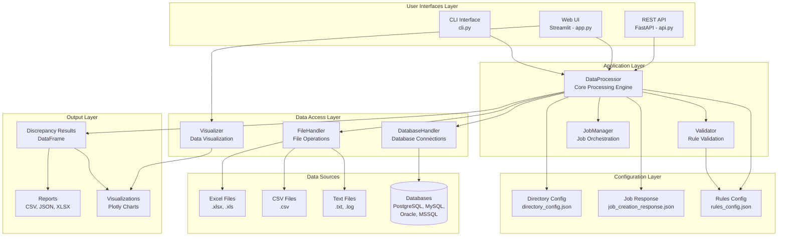
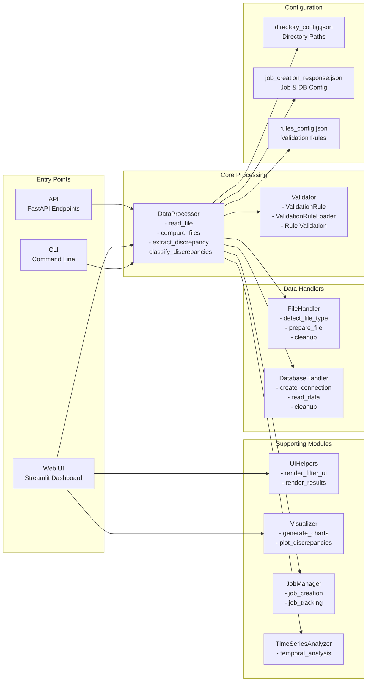
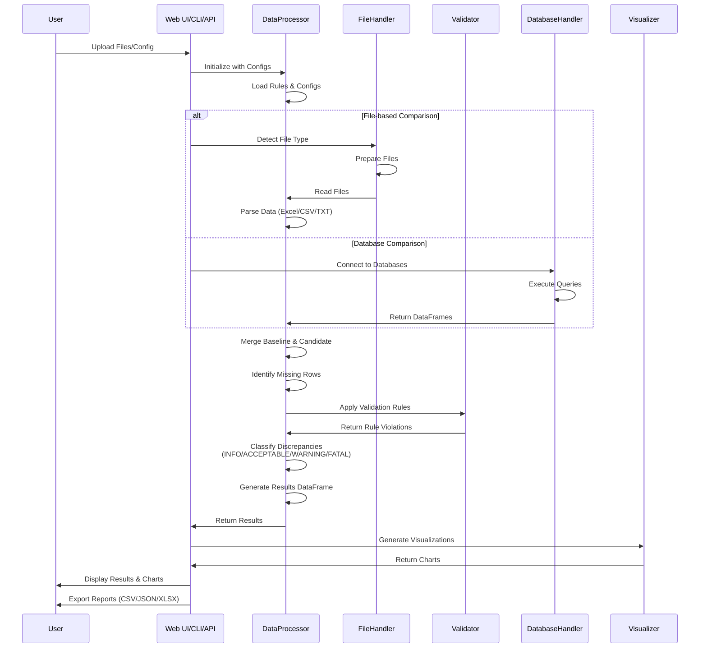
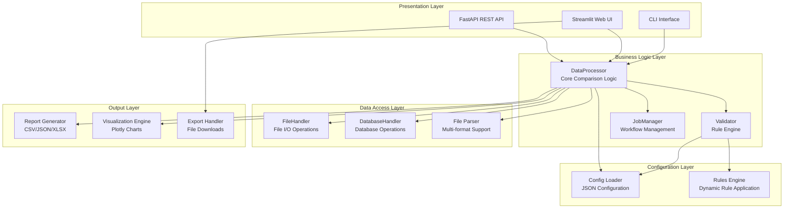
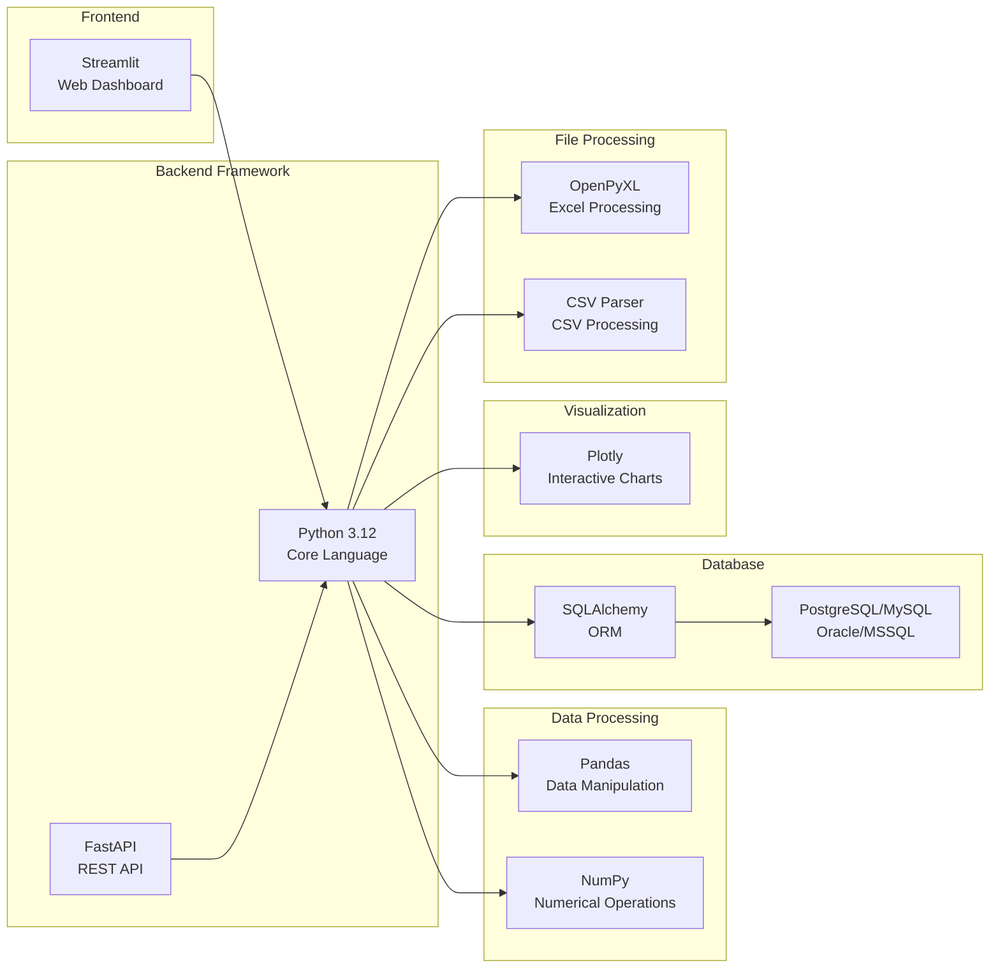

# ComparisonTrade - System Architecture Diagram

## High-Level Architecture

## Detailed Component Architecture

## Data Flow Architecture

## System Layers

## Technology Stack

## Component Responsibilities

### Entry Points
- **CLI (cli.py)**: Command-line interface for batch processing
- **Web UI (app.py)**: Interactive Streamlit dashboard for file upload and visualization
- **API (api.py)**: RESTful API endpoints for programmatic access

### Core Processing
- **DataProcessor**: Main orchestration engine for data comparison
  - File reading and parsing (Excel, CSV, TXT, Database)
  - Data merging and alignment
  - Discrepancy detection and classification
  - Filter processing and application

### Validation
- **Validator**: Rule-based validation engine
  - Loads rules from configuration
  - Applies validation rules to datasets
  - Categorizes discrepancies (INFO, ACCEPTABLE, WARNING, FATAL)

### Data Access
- **FileHandler**: Manages file operations
  - File type detection
  - Temporary file management
  - File cleanup

- **DatabaseHandler**: Database connectivity
  - Connection string creation
  - Query execution
  - Connection pooling and cleanup

### Supporting Modules
- **UIHelpers**: Streamlit UI components
- **Visualizer**: Chart and graph generation
- **JobManager**: Job lifecycle management
- **TimeSeriesAnalyzer**: Temporal data analysis

### Configuration
- **directory_config.json**: Directory paths and file locations
- **job_creation_response.json**: Job metadata and database configurations
- **rules_config.json**: Validation rules and thresholds

## Data Flow Summary

1. **Input**: User provides baseline and candidate files via CLI/Web/API
2. **Configuration**: System loads rules and directory configurations
3. **Processing**: DataProcessor reads, parses, and compares datasets
4. **Validation**: Validator applies rules and classifies discrepancies
5. **Output**: Results are formatted, visualized, and exported
6. **Cleanup**: Temporary files and connections are cleaned up

